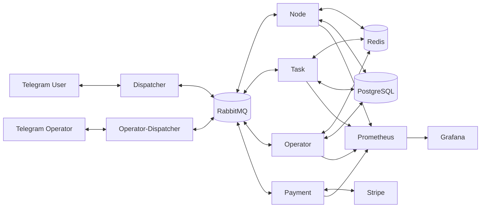

# Operator Bot

Operator Bot is an event-driven, microservice-based Telegram workflow platform built with Java and Spring Boot. The project separates user interaction, task processing, operator communication, and payment handling into independent services connected through RabbitMQ.

> This repository is a development/portfolio snapshot of an unfinished personal project. Runtime secrets and local Maven credentials are intentionally not included.

## Architecture



## Services

| Service | Responsibility |
| --- | --- |
| `Dispatcher` | User-facing Telegram entry point; receives updates/webhooks and exchanges messages with the backend through RabbitMQ. |
| `Node` | Central orchestration layer for user state and workflow coordination. |
| `Task` | Handles task lifecycle, processing, task state and task-related events. |
| `Operator` | Contains operator-side business logic and persistence-related workflow handling. |
| `Operator-Dispatcher` | Operator-facing Telegram transport layer and message dispatcher. |
| `Payment` | Integrates Stripe payment creation, webhook/event processing and payment feedback. |

## Tech stack

- Java 21
- Spring Boot 2.7
- Spring Web, Spring Data JPA and Spring AMQP
- RabbitMQ for asynchronous inter-service messaging
- PostgreSQL for persistent data
- Redis for shared state/cache-oriented workloads
- Telegram Bots API
- Stripe Java SDK
- Docker and Docker Compose
- Spring Boot Actuator + Micrometer
- Prometheus and Grafana
- Maven

## Key engineering ideas

- Event-driven communication between independently deployable services.
- Clear separation between Telegram transport, orchestration, task handling, operator workflow and payments.
- Containerized local environment with health checks and service dependencies.
- Externalized configuration through environment variables rather than committed secrets.
- Metrics exposure through Actuator/Micrometer with Prometheus and Grafana for observability.
- Shared DTO/JPA modules used across services to keep message and persistence models consistent.

## Repository structure

```text
Operator-Bot/
├── Dispatcher/
├── Node/
├── Operator/
├── Operator-Dispatcher/
├── Payment/
├── Task/
├── init-scripts/
├── monitoring/
├── prometheus/
└── docker-compose.yml
```

## Project status

This project is not presented as production-ready. Development was stopped before a complete automated test suite and final deployment setup were added. The repository is published primarily to demonstrate the architecture, backend implementation and technologies used.

## Running locally

### Prerequisites

- Docker with Docker Compose
- Java 21 and Maven if you want to build services outside Docker
- Access to the shared Maven packages `common-dto-operator-bot` and `common-jpa-operator-bot` from the `Nex1332/Operator-Bot-Dependencies` GitHub Packages repository

### Configuration

The application is configured through environment variables referenced by `docker-compose.yml`. These include Telegram bot tokens, database/Redis/RabbitMQ settings, queue names, Stripe credentials and port mappings.

Keep those values in a local `.env` file or your deployment secret store. Do not commit credentials or a personal Maven `settings.xml` file.

### Start the stack

    docker compose up --build

The Compose stack is the intended local environment. Building all services also requires access to the shared Maven packages listed above, so this public snapshot is not intended as a one-command standalone demo.

## Notes

This codebase was built as a practical microservice project and demonstrates backend architecture, asynchronous messaging, third-party API integration, containerization and observability. Environment-specific credentials are deliberately excluded from the repository.
